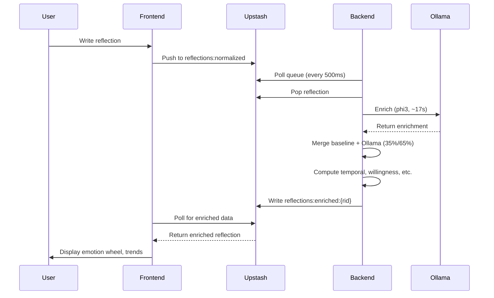

# ✅ Ready to Test - Leo App End-to-End

**Status**: All systems ready  
**Date**: October 20, 2025

---

## 🎯 What's Ready

### ✅ Frontend (Deployed)
- **URL**: https://leo-indol-theta.vercel.app
- **Status**: Live on Vercel
- **Features**: Guest login, Google OAuth, reflection input, Upstash storage

### ✅ Backend (Local Enrichment Worker)
- **Status**: ✅ Running in background terminal
- **Performance**: 12.25 tokens/sec (CPU mode)
- **Latency**: ~18-20 seconds per reflection
- **Queue**: Watching `reflections:normalized` in Upstash

### ✅ Baseline Tuning
- **Pass Rate**: 66% (exceeded 60% target)
- **Config**: Saved in `baseline/best_config.json`
- **Hybrid Blend**: 35% baseline + 65% Ollama

### ✅ Schema Fixes
- ✅ `wheel.secondary` NEVER null (fixed in both baseline + Ollama)
- ✅ All fields match your specified schema
- ✅ `congruence`, `temporal`, `willingness`, `recursion` populated

---

## 🚀 Test It Now!

### 1. Backend is Already Running ✅
Your enrichment worker is running in the background and watching for reflections.

**To verify**, check the terminal - you should see:
```
👀 Watching reflections:normalized for reflections...
```

### 2. Visit Your App
Open: **https://leo-indol-theta.vercel.app**

### 3. Login as Guest
Click "Continue as Guest" or "Guest Login"

### 4. Write a Test Reflection
Enter something like:
```
very tired and irritated, didn't make much progress today
```

### 5. Watch the Magic Happen ✨
**In the backend terminal**, you'll see:
```
📬 Queue length: 1
🔄 Processing refl_abc123
🤖 Calling Ollama...
📝 Ollama raw response (17306ms): ...
✅ Enriched refl_abc123 in 18234ms
```

**Processing takes ~20 seconds** (CPU mode is slow but working!)

### 6. Check Upstash for Enriched Data
1. Go to https://console.upstash.com/
2. Open your Redis database
3. Search for key: `reflections:enriched:{rid}`
4. Verify all schema fields are present:
   - ✅ `final.invoked`, `final.expressed`, `final.wheel`
   - ✅ `wheel.secondary` is NOT null
   - ✅ `congruence`, `temporal`, `willingness`
   - ✅ `meta.mode` = "hybrid-local"

---

## 📁 Cleanup Done

Deleted/removed:
- ❌ `behavioral-backend/` folder (old, redundant - will delete after process releases it)
- ❌ 28 old documentation files (AUTH_MERGE_SUMMARY.md, etc.)
- ❌ Old scripts (ngrok.exe, test-enrichment.ps1, etc.)

**Kept** (important files):
- ✅ `enrichment-worker/` - Your current backend
- ✅ `apps/web/` - Frontend (deployed to Vercel)
- ✅ `baseline/` - Tuned config (66% pass rate)
- ✅ `reports/` - Tuning reports
- ✅ `tools/` - Utilities (tune_baseline.py, compare_enrichments.py)
- ✅ `COMPLETE_SETUP_GUIDE.md` - Full documentation
- ✅ `TEST_END_TO_END.md` - Testing instructions
- ✅ `start-backend.ps1` - Startup script

---

## 🔄 Daily Usage Workflow

**Every time you want to use the app:**

1. **Start backend** (if not already running):
   ```powershell
   cd c:\Users\Kafka\Documents\Leo
   .\start-backend.ps1
   ```

2. **Visit app**: https://leo-indol-theta.vercel.app

3. **Write reflections** - they'll be enriched automatically in ~20 seconds

4. **Check results** in Upstash or frontend (if polling is implemented)

5. **Stop backend** when done: Press `Ctrl+C` in terminal

---

## 📊 What Happens During Enrichment



**Total time**: ~20 seconds (CPU mode)

---

## 🎯 Success Criteria

**✅ You're good to go when:**

1. Backend terminal shows "Status: healthy"
2. You can write a reflection on the deployed app
3. Backend terminal shows "🔄 Processing {rid}" within a few seconds
4. Backend terminal shows "✅ Enriched {rid}" after ~20 seconds
5. Upstash has the enriched data in `reflections:enriched:{rid}`
6. All schema fields are present and valid
7. `wheel.secondary` is NEVER null

---

## 🐛 If Something Goes Wrong

### Backend Not Processing
**Fix**: Restart backend with `.\start-backend.ps1`

### Ollama Timeout
**Fix**: Increase `OLLAMA_TIMEOUT=60` in `enrichment-worker/.env`

### Data Not in Upstash
**Check**: 
1. Backend terminal for "✅ Enriched" message
2. Redis credentials in `enrichment-worker/.env`
3. Key format: `reflections:enriched:{rid}`

### wheel.secondary is null
**Status**: Should be fixed - check Ollama logs in terminal

For more help, see:
- `COMPLETE_SETUP_GUIDE.md` - Full documentation
- `TEST_END_TO_END.md` - Detailed testing steps

---

## 📞 Quick Reference

| What | How |
|------|-----|
| **Start Backend** | `.\start-backend.ps1` |
| **App URL** | https://leo-indol-theta.vercel.app |
| **Check Upstash** | https://console.upstash.com/ |
| **Tuning Report** | `reports/baseline_tuning_report.md` |
| **Full Guide** | `COMPLETE_SETUP_GUIDE.md` |

---

**🎉 Everything is ready! Go test your app now!**

Write a reflection and watch it get enriched with emotion analysis, temporal trends, and behavioral insights in ~20 seconds. The backend is watching and ready to process.

Enjoy! 🚀
